# barn-door-sky-tracker
## Parts
* See bom.csv for parts list
* 3D printed parts use 20% infill
* Two of the following parts will need to be printed:
  * Part 2
  * Part 3
  * Part 5
  * Part 12

## Build Instructions
### Tools
1. M4x0.7 tap
2. Pliers
3. M2.5 allen key
4. Phillips head screw driver

### Steps
1. Print parts and acquire hardware per bom.csv
2. Clean up 3d printed parts
    1. Ensure gears are free of support material
    2. Ensure Part 6 has all internal support material removed
3. Tap threads into Part 6 and 10

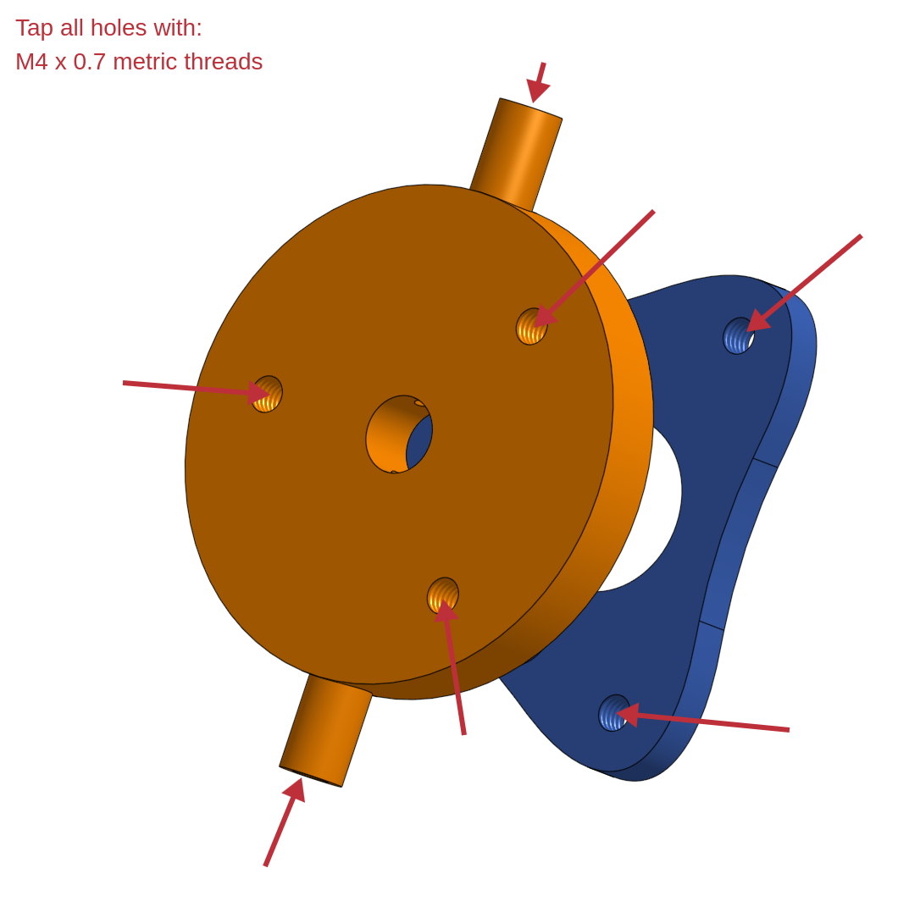

4. Begin assembly of pivot with Part 2 and 3
   1. Bearing is fit between parts per diagram

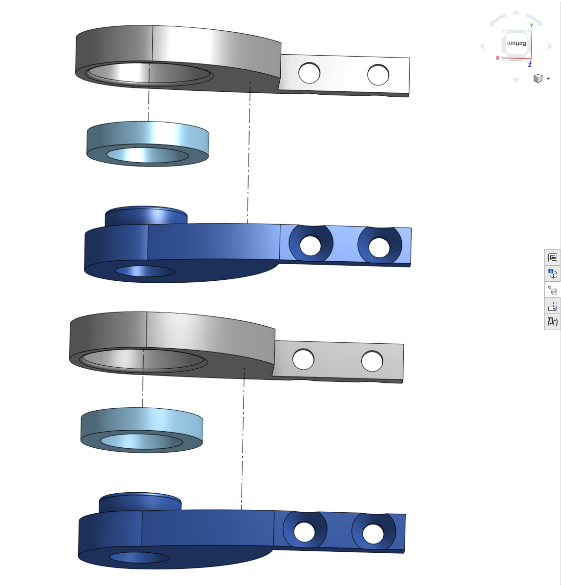

5. Begin motor assembly with Part 5, 6, 9, 10, 11, 12 and spur center

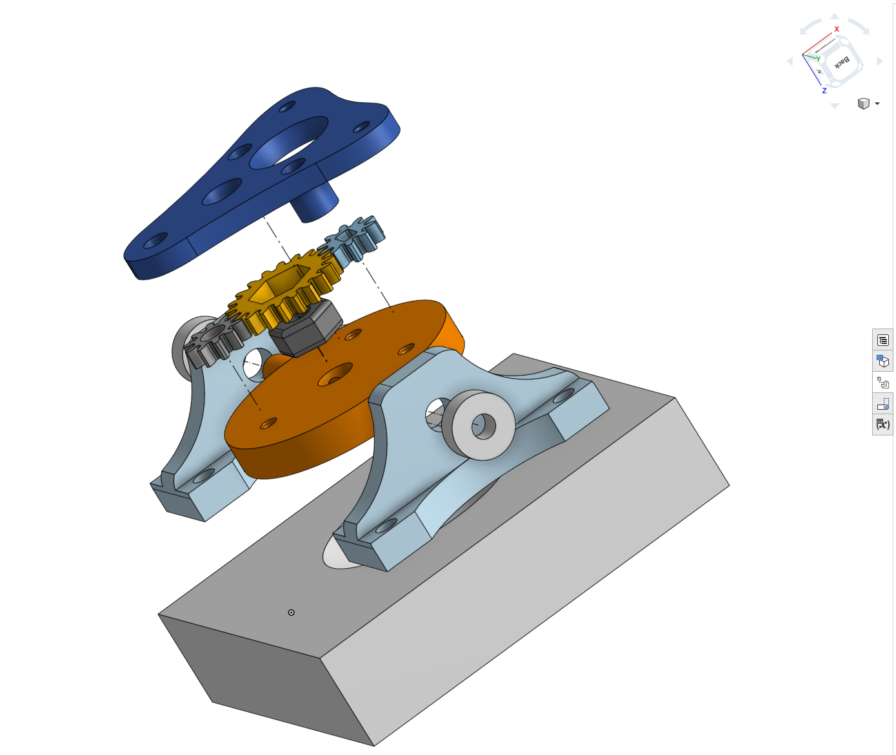

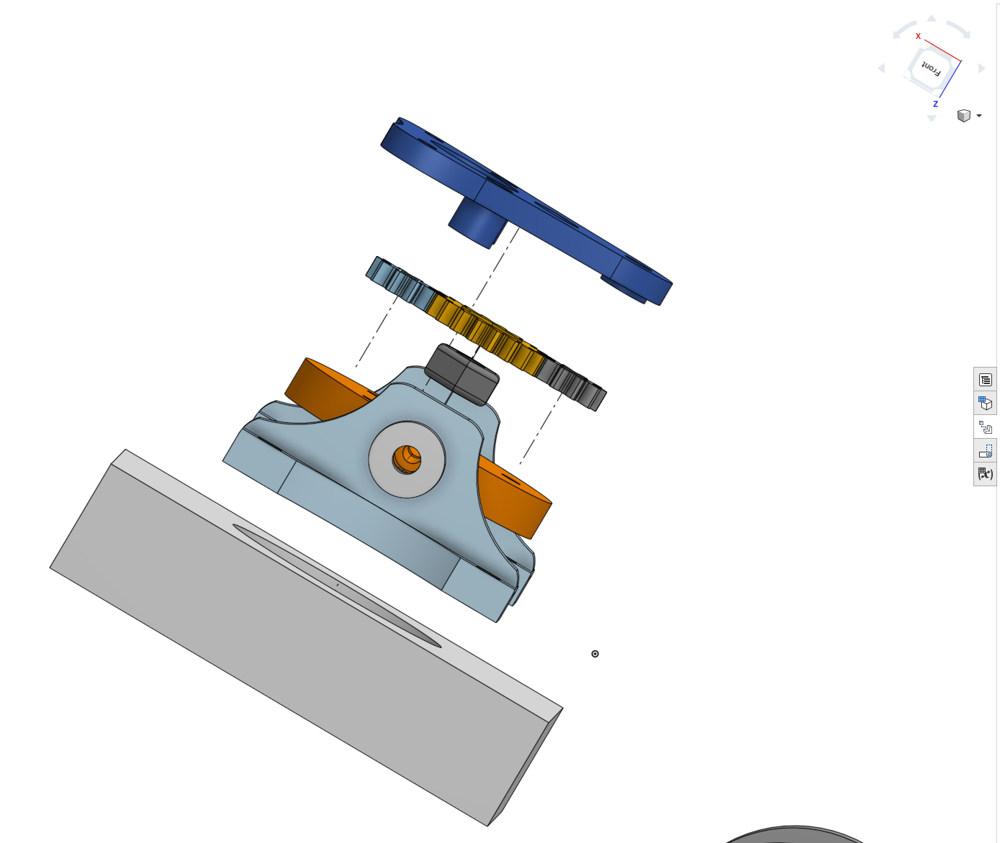

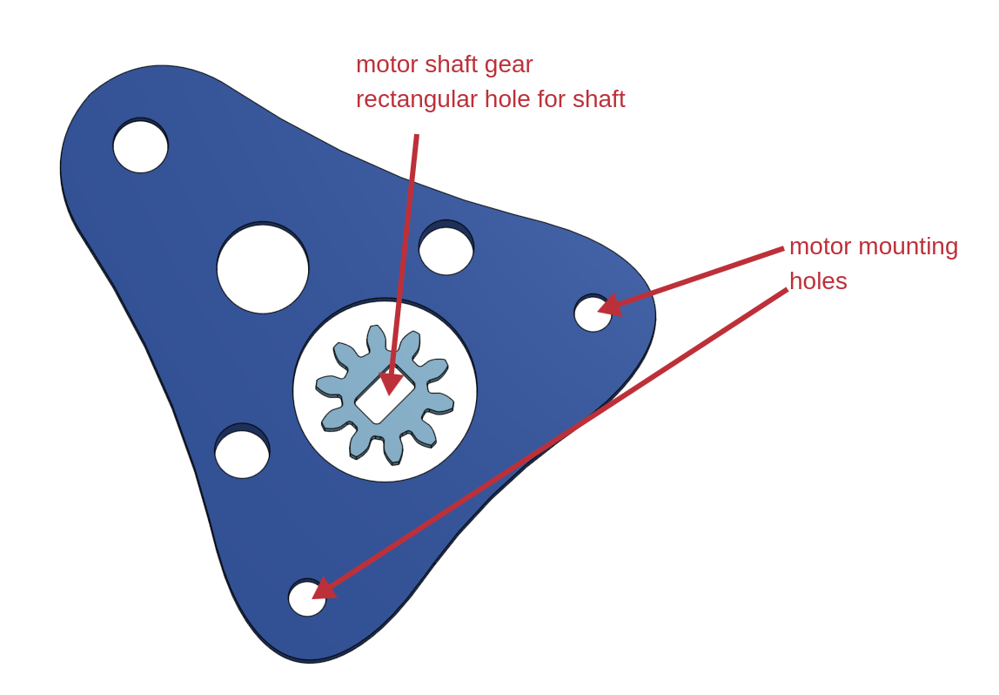

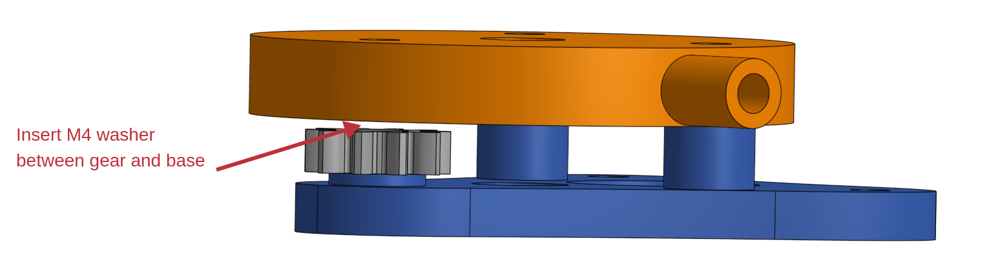

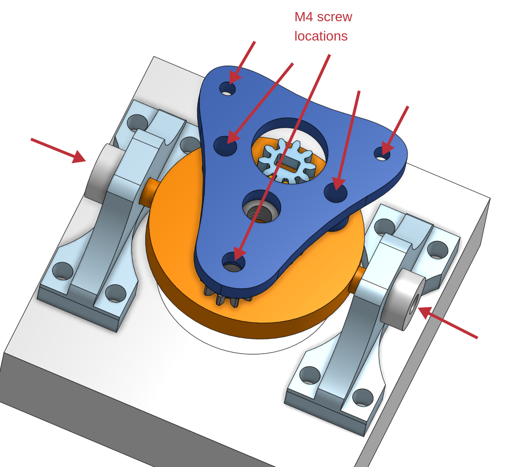

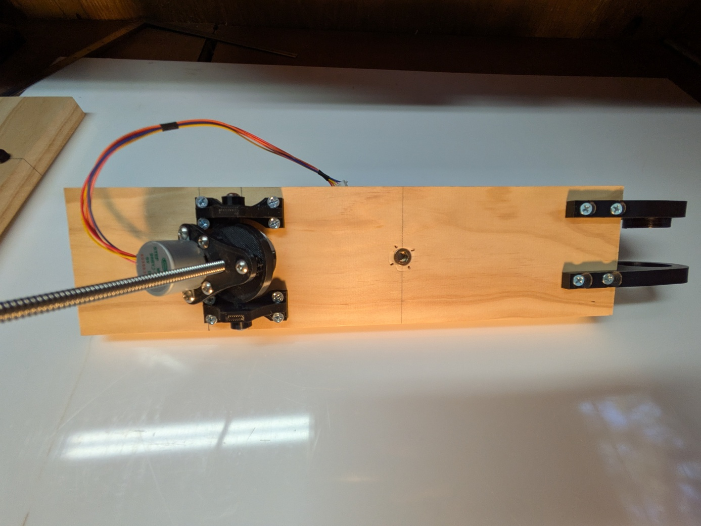

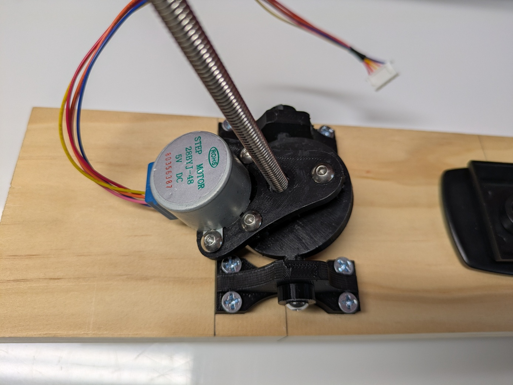

6. Attach 1/4 round cap to 1/4-20 threaded rod
   1. Use thread locker red or an adhesive that works on metal

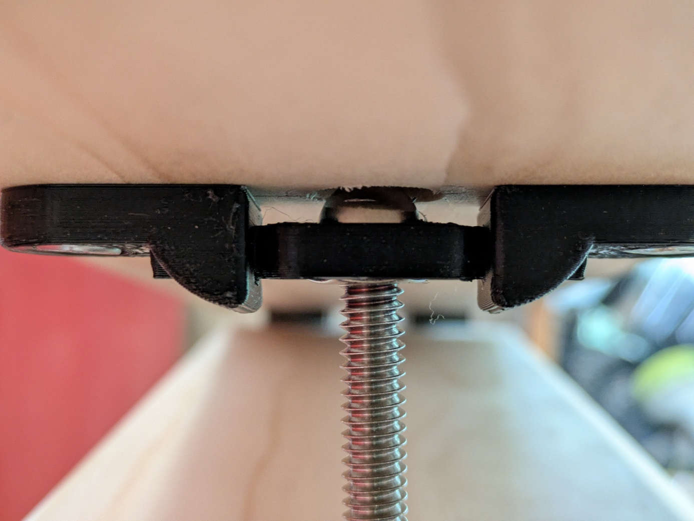

7. Wooden components
   1. Primary concern with wooden components is that the motor relative to pivot is 29cm
   2. Dimensions in mm, closest imperial equivalent is good enough (**stock must be 3/4" for pivot**)

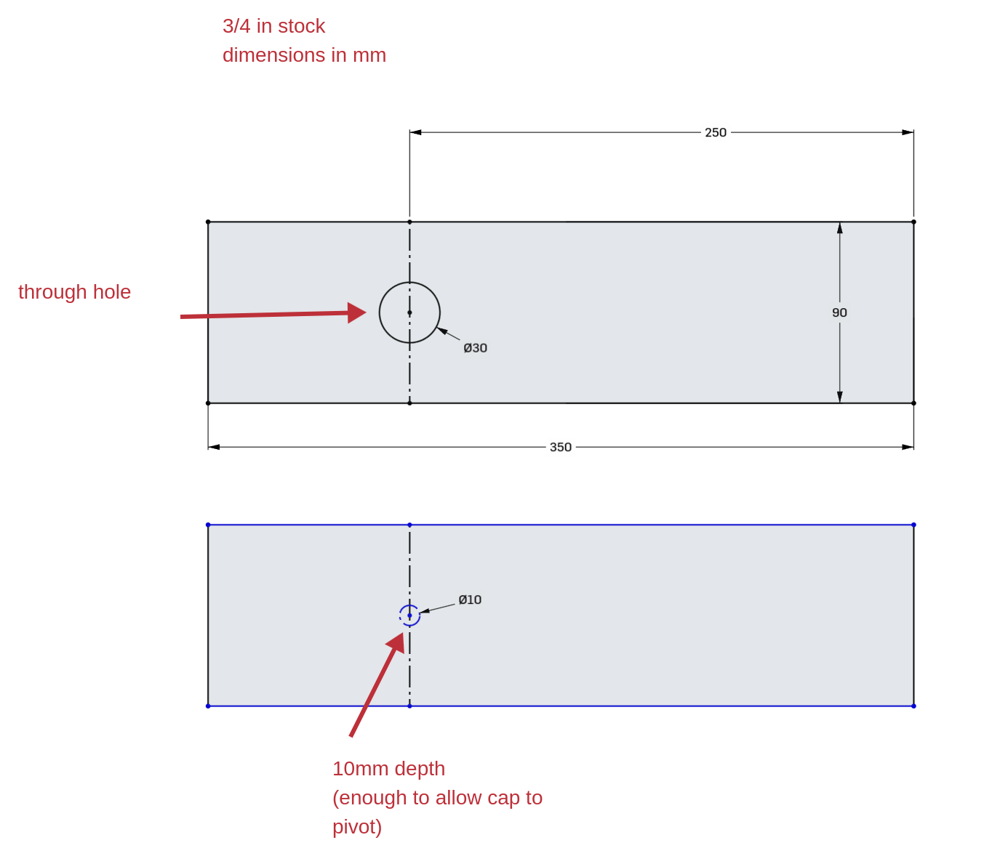

8. Electronics wiring as below
   1. See barn-door-tracker.ino for code

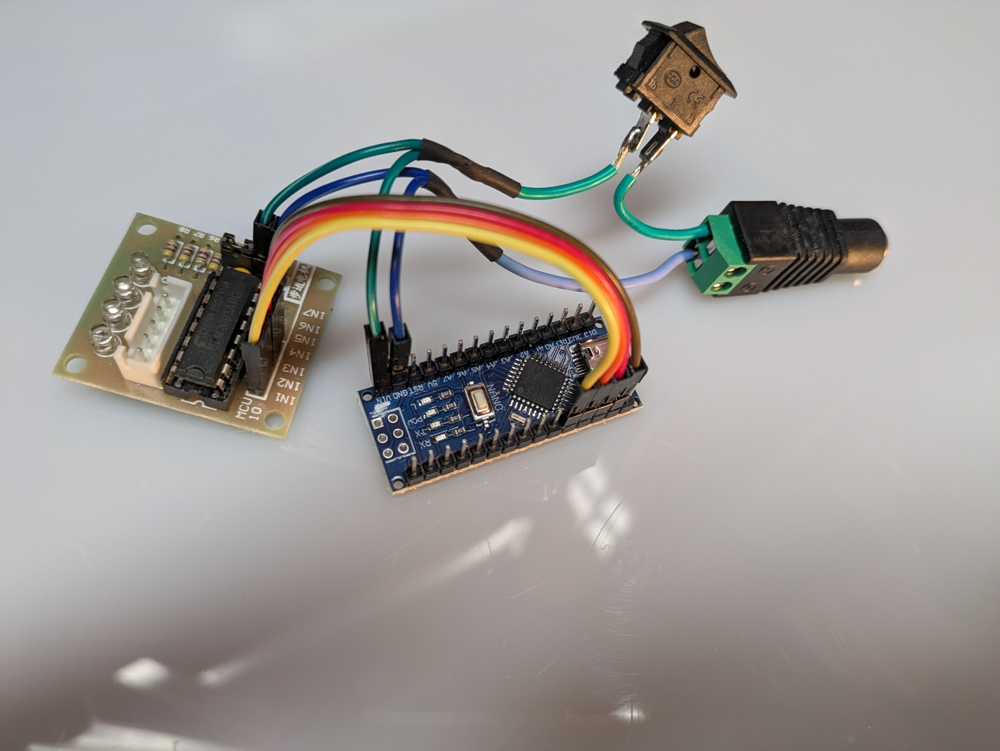